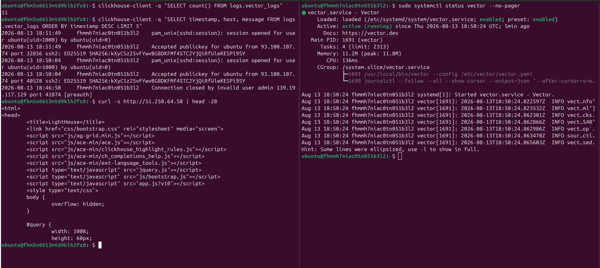

## Домашнее задание к занятию 3 «Использование Ansible»
***


### 1. С помощью terraform создано 3 ВМ:
- vm-clickhouse
- vm-vector
- vm-lighthouse
```amplicode sql
data "yandex_compute_image" "ubuntu" {
  family = var.vm_family
}

resource "yandex_vpc_network" "develop" {
  name = var.vpc_name
}
resource "yandex_vpc_subnet" "develop" {
  name           = var.vpc_name
  zone           = var.default_zone
  network_id     = yandex_vpc_network.develop.id
  v4_cidr_blocks = var.default_cidr
}


variable "each_vm" {
  type = list(object({
    vm_name       = string
    cpu           = number
    ram           = number
    disk_volume   = number
    core_fraction = number
  }))
  default = [
    {
      vm_name       = "vm-clickhouse"
      cpu           = 2
      ram           = 2
      disk_volume   = 10
      core_fraction = 20
    },
    {
      vm_name       = "vm-vector"
      cpu           = 2
      ram           = 2
      disk_volume   = 10
      core_fraction = 20
    },
    {
      vm_name       = "vm-lighthouse"
      cpu           = 2
      ram           = 2
      disk_volume   = 10
      core_fraction = 20
    }
  ]
}

locals {
  db_instances = { for vm in var.each_vm : vm.vm_name => vm }
}

resource "yandex_compute_instance" "databases" {
  for_each    = local.db_instances
  name        = each.value.vm_name
  platform_id = "standard-v3"
  zone        = var.default_zone

  resources {
    cores         = each.value.cpu
    memory        = each.value.ram
    core_fraction = each.value.core_fraction
  }

  boot_disk {
    initialize_params {
      image_id = "fd8ulqth5qf5suqiecli"
      size     = each.value.disk_volume
    }
  }

  network_interface {
    subnet_id = yandex_vpc_subnet.develop.id
    nat       = true
  }

  metadata = {
    ssh-keys = "ubuntu:${file("~/.ssh/terraform_key.pub")}"
  }

  scheduling_policy {
    preemptible = true
  }
}
```

### 2. Создан playbook с тремя ролями:
- запуск clickhouse для хранения логов
- запуск vector для сбора логов
- запуск lighthouse для интерфейса и взаимодействия с clickhouse